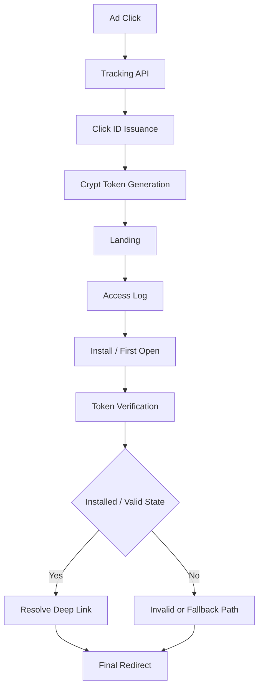

# deferred-deeplink-backend

[](https://github.com/Gseobi/deferred-deeplink-backend/actions/workflows/ci.yml)

광고 유입 이후 앱 설치 전/후가 분리되는 상황에서 **서버 기준 추적, 검증, 분기 처리**를 중심으로 deferred deeplink 흐름을 재구성한 Backend 프로젝트입니다.

</br>

## 1. Quick Proof

- **광고 클릭 시점과 앱 최초 실행 시점이 분리되는 환경**을 서버 기준으로 연결하는 프로젝트입니다.
- **Click ID 발급 + crypt 토큰 + access log** 구조로, 설치 전 상태를 보존하고 최초 실행 시 위변조 여부를 검증합니다.
- 단순 링크 생성보다 **상태 추적, 요청 검증, 최종 분기 제어**를 Backend 책임으로 설계했습니다.

</br>

## 2. Execution Evidence

### Main Flow



### Example Request Flow

```http
GET /install/{app_type}
GET /install/landing
GET /install/check
```

### Example Verification Log

```text
[Tracking API] Ad click received: appType=shop
[Click ID] Issued clickId=20260404-000231
[Crypt] Token generated successfully
[Landing] Access log created: accessSeq=48125
[Install Check] First open verification requested
[Token Verification] crypt + access_seq + user_pin matched
[Routing] app_type=shop, os=android, installed=true
[Redirect] Final deep link resolved successfully
```

### What This Proves

- deferred deeplink는 **링크 생성보다 상태 연결과 검증 구조**가 더 중요합니다.
- Client 상태를 그대로 신뢰하지 않고, **서버가 click / access / token 기준으로 유효성을 판단**합니다.
- 설치 전후가 끊기는 환경에서도 **최종 진입 경로를 통제 가능한 구조**로 설계했습니다.

</br>

## 3. Problem & Design Goal

이 프로젝트는 deferred deeplink를 단순 링크 생성 기능이 아니라 **서버 기준 검증과 상태 추적 문제**로 보고 설계한 프로젝트입니다.

일반 딥링크와 달리 deferred deeplink는 광고 클릭 시점과 앱 최초 실행 시점이 분리되어 있기 때문에, 중간 상태를 어떻게 보존하고 최종 진입을 어떻게 검증할지가 중요합니다.

실제 서비스에서는 아래와 같은 문제가 중요합니다.

- 광고 클릭 시점 식별자 발급
- 설치 전 상태 보존
- 앱 최초 실행 시 위변조 방지
- 다중 앱 또는 다중 광고 경로 분기
- 접근 로그 및 운영 추적 가능성 확보
- Client 상태를 그대로 신뢰하지 않는 검증 구조

이 프로젝트는 이를 아래 흐름으로 해결합니다.

- 광고 클릭 시 서버에서 Click ID 발급
- 암호화된 `crypt` 토큰 생성 및 전달
- landing 진입 시 접근 이력 생성
- 최초 실행 시 `crypt + access_seq + user_pin` 검증
- `app_type` 및 OS 기준 최종 분기 처리

즉, 이 프로젝트는 딥링크 URL 생성보다 **서버 기준 식별, 검증, 상태 연결**을 우선하는 Backend 프로젝트입니다.

</br>

## 4. Key Design

### 1) DB Function 기반 Click ID 발급

Click ID를 애플리케이션 메모리에서 단순 생성하지 않고 DB Function 기준으로 발급하도록 구성했습니다.

- 식별자 발급 책임을 DB 경계로 분리
- 추적 흐름의 기준점을 Server 측에 고정
- Click 데이터 lifecycle을 통제 가능한 구조로 정리

핵심은 식별자 생성 자체보다, **발급 책임을 어디에 둘 것인가**입니다.

### 2) 서버 기준 검증과 암호화 토큰 보호

이 프로젝트는 Client가 전달하는 정보를 그대로 신뢰하지 않습니다.

- `crypt` 기반 전달값 보호
- 최초 실행 시 복호화 및 위변조 검증
- 비정상 요청은 최종 분기 전에 차단

즉, 검증 로직은 부가 기능이 아니라 프로젝트의 핵심 설계 요소입니다.

### 3) 설치 상태와 다중 앱 분기를 고려한 최종 진입 설계

최종 진입 경로는 단순 URL 하나로 결정되지 않습니다.

- `app_type` 기준 앱별 분기
- OS 기반 접근 제어
- 설치 여부에 따른 landing / store / app 진입 처리
- 하나의 Backend에서 복수 앱 유입 관리 가능

이 구조를 통해 deferred deeplink를 “링크 생성”이 아닌 **상태 기반 라우팅 문제**로 다뤘습니다.

</br>

## 5. Architecture / APIs

### Flow Summary

1. 사용자가 광고 링크를 클릭합니다.
2. 서버가 Click ID를 발급하고 `crypt` 토큰을 생성합니다.
3. landing 페이지로 이동하면서 접근 이력을 생성합니다.
4. 앱 설치 또는 최초 실행 이후 `crypt`, `access_seq`, `user_pin` 조합을 검증합니다.
5. 서버가 설치 상태와 요청 유효성을 확인합니다.
6. `app_type` 및 OS 기준으로 최종 경로를 분기합니다.
7. 사용자는 앱 또는 적절한 경로로 이동합니다.

### Main Flow Components

- click tracking
- `crypt` 생성 및 검증
- access log 추적
- `app_type` 기준 분기
- OS 기반 요청 제어
- 최종 redirect 결정

### Main APIs

- `GET /install/{app_type}`
- `GET /install/landing`
- `GET /install/check`

</br>

## 6. Why These Technologies

- **Spring Boot**: API, Validation, 서비스 계층 구성을 명확하게 가져가기 적합했습니다.
- **JPA + Querydsl**: 저장과 조회 책임을 분리하고, 조건 기반 상태 검증 의도를 분명하게 표현하기 위해 사용했습니다.
- **DB Function**: Click ID 발급 책임을 애플리케이션이 아니라 DB 경계에 두기 위해 선택했습니다.
- **AES256 기반 `crypt` 처리**: 전달값 보호와 위변조 방지 관점에서 핵심 역할을 합니다.
- **JSP + JavaScript / Ajax**: landing / check 흐름을 포함한 서버 + WebView 연계 구조를 설명하기 위해 사용했습니다.

### Tech Stack

- Java 17
- Spring Boot 3.x
- Spring Data JPA
- Querydsl
- JSP
- JavaScript / Ajax
- Oracle / PostgreSQL / MySQL
- Logback
- Gradle
- GitHub Actions

</br>

## 7. Test / Exception / Extensibility

### Test Focus

- User-Agent 기반 OS 판별
- Client IP 추출
- AES256 기반 `crypt` 암호화 / 복호화
- install / landing / check Controller 흐름
- `crypt` 생성 및 Click 저장
- landing 모델 생성 및 invalid 분기
- 최초 실행 검증 및 access log 처리

### Exception Handling

- **Invalid Request**: 잘못된 OS, 잘못된 파라미터, 비정상 접근은 조기 차단
- **Token Validation Failure**: 복호화 실패, 위변조, 유효하지 않은 요청은 최종 진입 전 차단
- **State Mismatch**: 설치 전/후 상태 또는 접근 이력 불일치 시 정상 흐름으로 처리하지 않음
- **Routing Failure**: `app_type` 또는 분기 기준이 올바르지 않으면 fallback 또는 invalid 처리
- **Operational Tracking**: access log 기준으로 추적 가능한 흐름 유지

### Extensibility

- 토큰 만료 및 재사용 방지 정책 보강
- Click / Access 추적 metrics 강화
- 다중 광고 채널 파라미터 추상화
- 운영 로그 및 error response 구조 정리
- WebView 연동 흐름 문서화 보강
- 동일 Client 필터링 강화

핵심은 단순 링크 기능이 아니라, **장기적으로도 신뢰 가능한 유입 추적 구조를 만드는 것**입니다.

</br>

## 8. Notes / Blog

### Project Docs

- [Design Notes](docs/design-notes.md)
- [Test Report](docs/test-report.md)
- [Troubleshooting Notes](docs/troubleshooting.md)

### Blog

이 프로젝트의 설계 배경과 설치 전후 상태 검증 구조는 아래 글에 정리했습니다.

[설치 전후가 끊기는 환경에서 Deferred Deeplink를 서버 기준으로 검증하는 구조](https://velog.io/@wsx2386/%EC%84%A4%EC%B9%98-%EC%A0%84%ED%9B%84%EA%B0%80-%EB%81%8A%EA%B8%B0%EB%8A%94-%ED%99%98%EA%B2%BD%EC%97%90%EC%84%9C-Deferred-Deeplink%EB%A5%BC-%EC%84%9C%EB%B2%84-%EA%B8%B0%EC%A4%80%EC%9C%BC%EB%A1%9C-%EA%B2%80%EC%A6%9D%ED%95%98%EB%8A%94-%EB%B0%A9%EB%B2%95)

Keywords: `Deferred Deeplink`, `Token Validation`, `App Routing`, `OS Detection`, `Querydsl`
