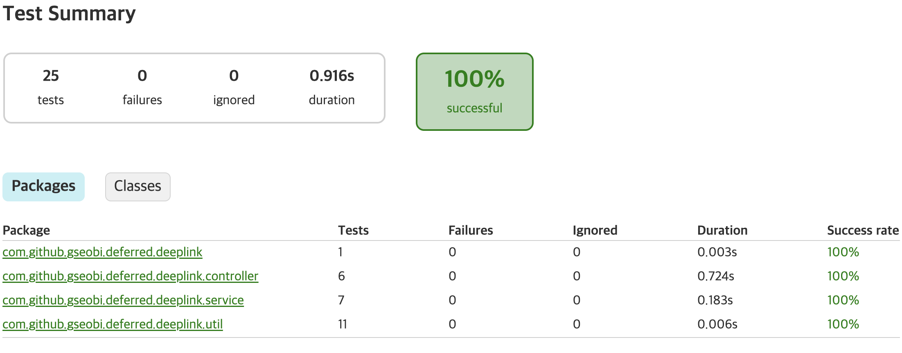
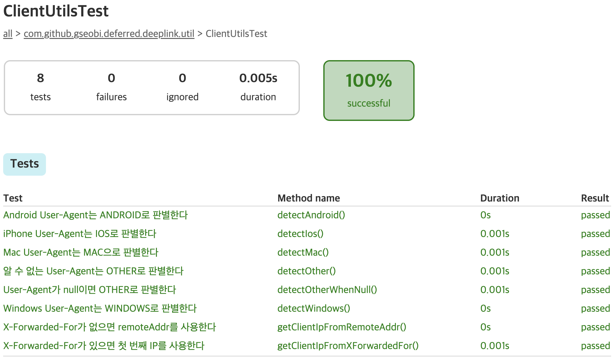
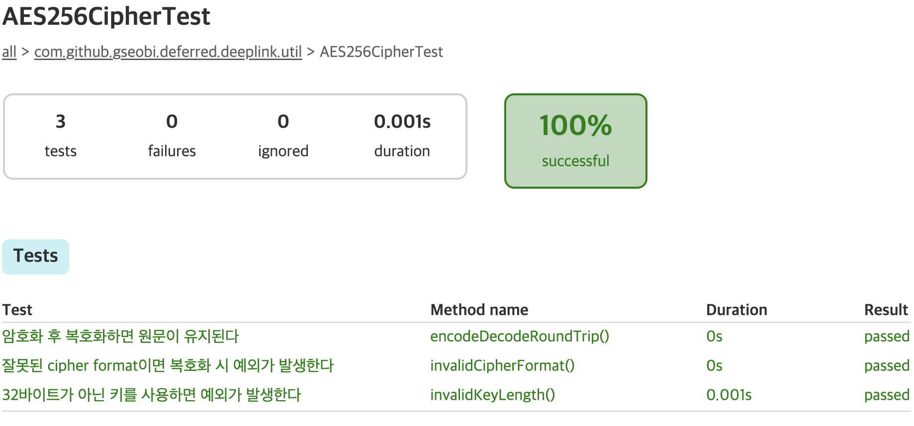
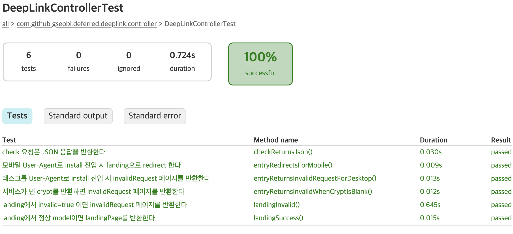
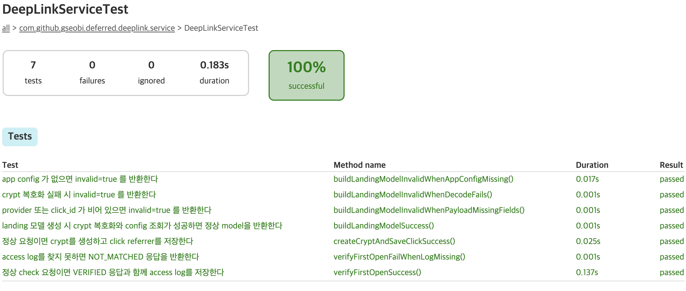
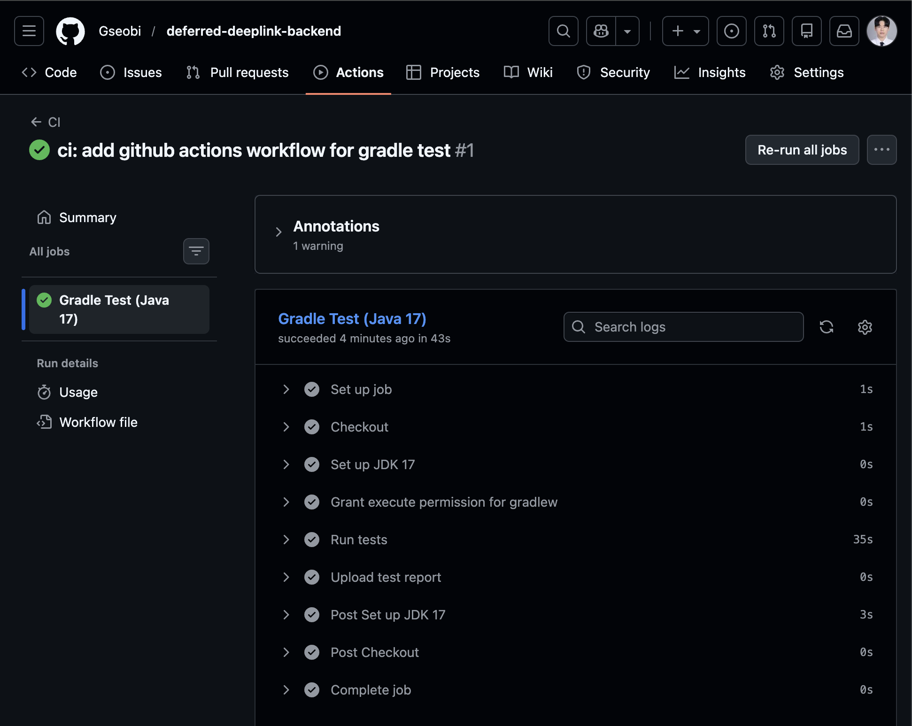

# Test Report

## 1. Overview

본 문서는 `deferred-deeplink-backend` 프로젝트에서 실제로 구성하고 실행한 자동화 테스트 항목을 정리한 문서입니다.

이 프로젝트는 광고 링크 클릭 이후 앱 설치 및 최초 실행까지의 흐름을  
서버 기준으로 추적·검증하는 deferred deeplink 구조를 설명하는 데 목적이 있습니다.

자동화 테스트는 다음 관점에 초점을 두고 구성했습니다.

- User-Agent 기반 OS 판별
- 클라이언트 IP 추출
- AES256 기반 `crypt` 암호화 / 복호화
- install / landing / check 컨트롤러 흐름
- `crypt` 생성 및 click 저장
- landing 모델 생성
- 최초 실행 검증 처리

<br/>

## 2. Test Environment

- Java 17
- Spring Boot 3.x
- Spring Data JPA
- Querydsl
- JSP
- JavaScript / Ajax
- JUnit 5
- Mockito
- Gradle

<br/>

## 3. Automated Test Classes

### 3.1 ClientUtilsTest

**Purpose**
- User-Agent 기반 OS 판별 및 클라이언트 IP 추출 로직 검증

**Covered Cases**
- Android User-Agent → `ANDROID`
- iPhone User-Agent → `IOS`
- Windows User-Agent → `WINDOWS`
- Mac User-Agent → `MAC`
- Unknown / null User-Agent → `OTHER`
- `X-Forwarded-For` 우선 IP 추출
- fallback `remoteAddr` 사용

**Result**
- 8개 테스트 모두 통과

<br/>

### 3.2 AES256CipherTest

**Purpose**
- `crypt` 생성 및 복호화에 사용하는 AES256 유틸 로직 검증

**Covered Cases**
- encode → decode round-trip
- 32바이트가 아닌 키 사용 시 예외
- 잘못된 cipher format 복호화 시 예외

**Result**
- 3개 테스트 모두 통과

<br/>

### 3.3 DeepLinkControllerTest

**Purpose**
- deferred deeplink 엔드포인트의 요청/응답 흐름 검증

**Covered Cases**
- 데스크톱 User-Agent 접근 시 `invalidRequest` 페이지 반환
- 모바일 User-Agent 접근 시 `/install/landing?crypt=...` redirect
- 빈 `crypt` 반환 시 invalid 페이지 처리
- landing 요청에서 `invalid=true` 모델 처리
- landing 요청에서 정상 모델 기반 `landingPage` 렌더링
- check 요청 JSON 응답 검증

**Result**
- 6개 테스트 모두 통과

<br/>

### 3.4 DeepLinkServiceTest

**Purpose**
- deferred deeplink 핵심 서비스 로직 검증

**Covered Cases**
- 정상 install 요청 시 `crypt` 생성 및 click 저장
- landing 모델 생성 성공
- crypt 복호화 실패 시 invalid 처리
- payload 필수 값 누락 시 invalid 처리
- app config 조회 실패 시 invalid 처리
- 정상 최초 실행 검증 시 VERIFIED 응답 및 access log 저장
- access log 미존재 시 NOT_MATCHED 응답

**Result**
- 7개 테스트 모두 통과

<br/>

### 3.5 DeferredDeeplinkApplicationTests

**Purpose**
- 기본 테스트 클래스 유지

**Covered Cases**
- 기본 테스트 클래스 실행 확인

**Result**
- 1개 테스트 통과

<br/>

## 4. Full Test Summary

로컬 환경에서 아래 명령어로 전체 테스트를 실행했습니다.

```bash
./gradlew clean test
```
전체 테스트 결과는 아래와 같습니다.
- 총 25건 테스트
- 실패 0건
- 성공률 100%

<br/>

## 5. Verification Summary

본 프로젝트에서 자동화 테스트를 통해 확인한 핵심 항목은 다음과 같습니다.

- User-Agent 기반 OS 판별
- 클라이언트 IP 추출
- AES256 기반 `crypt` 암호화 / 복호화
- install / landing / check 요청 흐름
- 광고 클릭 시 `crypt` 생성 및 저장
- landing 진입 시 모델 구성
- 최초 실행 시 access log 기반 검증 처리

이를 통해 `deferred-deeplink-backend`는
단순 설명형 딥링크 예제가 아니라,
광고 유입부터 설치 및 최초 실행 검증까지의 흐름을
자동화 테스트로 검증 가능한 구조로 정리한 포트폴리오 프로젝트로 구성되었습니다.

<br/>

## 6. Notes
- 본 자동화 테스트는 실제 광고 플랫폼 전체를 재현하기보다 핵심 서버 흐름 검증에 초점을 두었습니다.
- 컨트롤러 테스트는 standalone MockMvc 기반으로 구성하여 웹 요청/응답 흐름을 검증했습니다.
- 전체 애플리케이션 full-context 테스트보다 핵심 기능 테스트를 우선하는 방향으로 정리했습니다.

## 7. Test Report Snapshot





